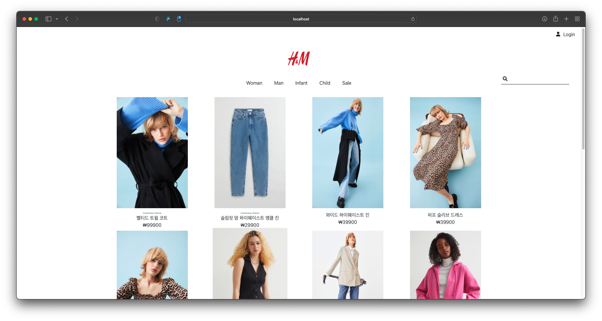
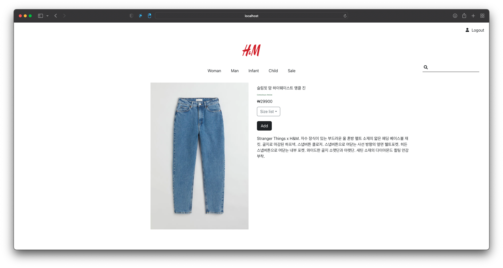
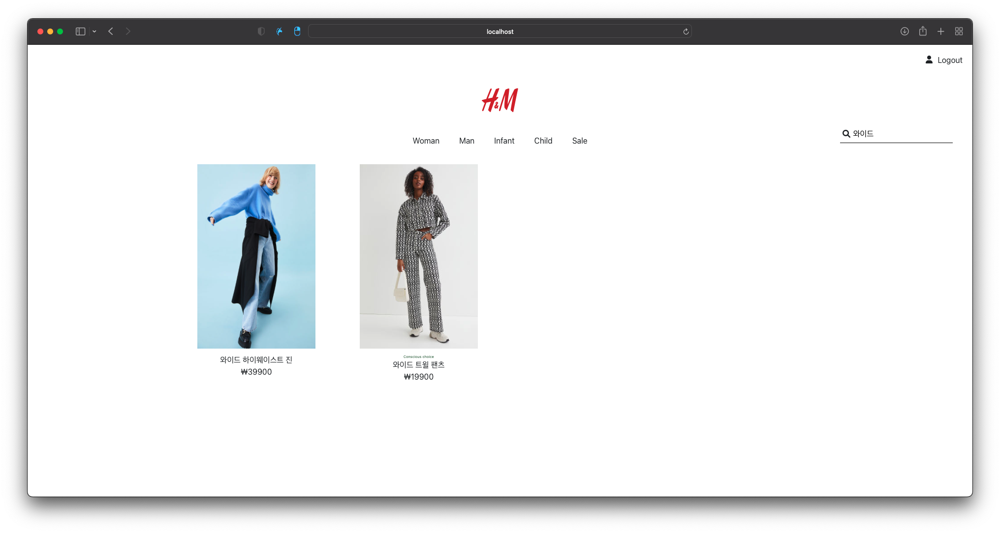
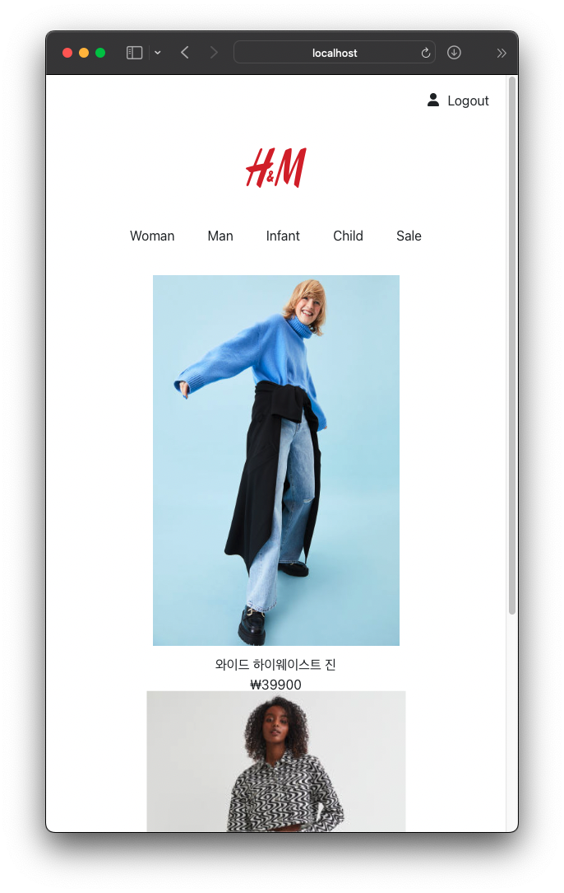

<h1>H&M</h1>
<h3>https://kjkj2077-shoppingmall.netlify.app/</h3>
<h3>I copied the H&M site.</h3>
<h3>FontAwesomeIcon, Bootstrap, React.js</h3>
<h3>Function: Router, Login, Logout, Search, Responsive Web, Using JSON</h3>
  
<h3>List</h3>

<h3>Detail</h3>

<h3>Search</h3>

<h3>Mobile(Responsive Web)</h3>

  
<h4>FontAwesomeIcon, Bootstrap, React.js</h4>
